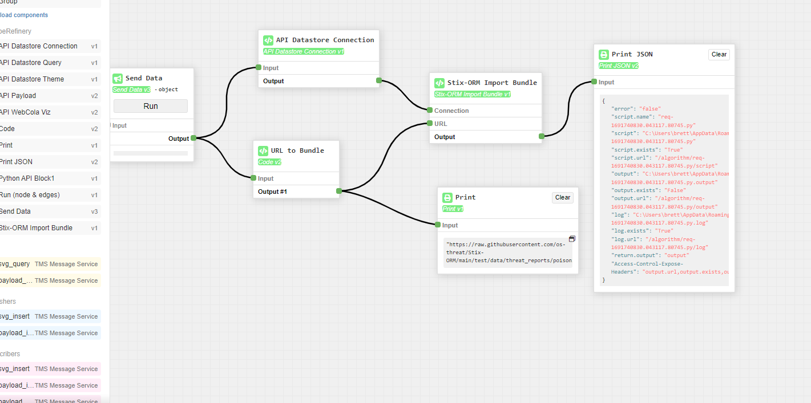

# Import Bundle 

This block is designed to load files containing Stix bundles from the test directory. 

It takes two inputs:
1. Connection: A Connection object
2. URL: A string containing the valid url for the example data

It has a single output:
1. Output: A json string containing a Success object (to be made up signifying successful load)

So the block is commonly used chained by a trgger, and url data blocks, and then the layout would like 

In this the json is a Stix 2.1 Report object called poison ivy
https://raw.githubusercontent.com/os-threat/Stix-ORM/main/test/data/threat_reports/poisonivy.json